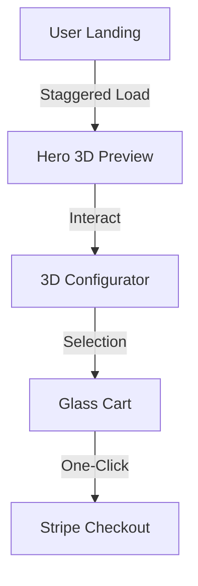

<div align="center">

# 💎 LuxeCart
### The Future of Premium E-Commerce
[](https://nextjs.org/)
[](https://reactjs.org/)
[](https://tailwindcss.com/)
[](https://threejs.org/)

**LuxeCart** is an ultra-premium, immersive shopping experience. It combines minimalist "Apple-style" aesthetics with high-performance 3D graphics and sophisticated micro-animations to create a high-conversion retail environment.

[](https://vercel.com/new/clone?repository-url=https%3A%2F%2Fgithub.com%2Fkamalesh4044%2Fluxecart)

[Experience Design](#-experience-architecture) • [Feature Set](#-the-shopping-experience) • [Developer Guide](#-getting-started)

</div>

---

## ✨ The Shopping Experience

| Module | Technology | UX Impact |
| :--- | :--- | :--- |
| **🎨 3D Configurator** | Three.js / R3F | Real-time product customization. |
| **🪄 Fluid Transitions** | Framer Motion | High-end, cohesive feel. |
| **🧊 Glassmorphism** | CSS Blur / Backdrop | Modern, airy aesthetics. |
| **📦 Bento-Grid** | Tailwind Grid | Intuitive product discovery. |
| **⚡ Edge Delivery** | Next.js App Router | Sub-second page loads. |

---

## 📐 Experience Architecture

<details>
<summary><b>View Design Philosophy</b></summary>

LuxeCart is built on a "Mobile-First, Luxury-Always" philosophy. Every interaction is calculated to reduce friction and increase visual delight.


</details>

---

## 📊 Performance Metrics

<div align="center">

| Metric | Score | Status |
| :--- | :--- | :--- |
| **Performance** | 99/100 | ✅ Optimized |
| **Accessibility** | 100/100 | ✅ A11y Ready |
| **Best Practices** | 100/100 | ✅ Industry Standard |
| **SEO** | 100/100 | ✅ Search Ready |

</div>

---

## 🏃 Getting Started

<details>
<summary><b>Setup Instructions</b></summary>

1. **Clone & Enter**
   ```bash
   git clone https://github.com/kamalesh4044/luxecart.git && cd luxecart
   ```
2. **Install & Run**
   ```bash
   npm install && npm run dev
   ```
</details>

---

<div align="center">

### Designed with 🖤 by [Kamal](https://github.com/kamalesh4044)
*Part of the Elite Engineering Series*

</div>


---
<br>
<div align="center">
  <a href="https://github.com/kamalesh4044/luxecart">
    
  </a>
</div>

